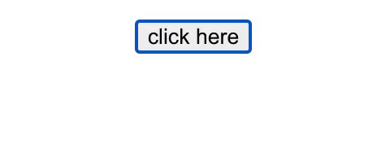

# react-popover-lite

A simple popover React higher-order component with zero dependencies, TypeScript support.

This popover is implemented using [React Portal](https://reactjs.org/docs/portals.html).

## Install

```shell
yarn add react-popover-lite
```

or

```shell
npm install react-popover-lite --save
```

## Examples



```JSX
import React, { useState } from "react";
import Popover from "react-popover-lite";

...

const [isOpen, setOpen] = useState(false);

<Popover
  isOpen={isOpen}
  position="bottom"
  onClickOutside={() => setOpen(false)}
  content={
    <div
      style={{
        border: "1px solid black",
        padding: 10,
        width: 200,
        marginTop: 10,
      }}
    >
      this is the popover content
    </div>
  }
>
  <button onClick={() => setOpen(!isOpen)}>click here!</button>
</Popover>
```

## API

| <b>Props<b>    | Type                                                                                         | Required | Description                                            |
| -------------- | -------------------------------------------------------------------------------------------- | :------: | ------------------------------------------------------ |
| children       | `ReactNode`                                                                                  |    ✓     | A React child which the popover's position will follow |
| isOpen         | `Boolean`                                                                                    |    ✓     | Show/hide popover                                      |
| onClickOutside | `() => void`                                                                                 |          | Handle event when user clicking outside of the popover |
| content        | `ReactNode`                                                                                  |    ✓     | Popover content                                        |
| position       | 'top' \| 'right'\| 'bottom'\| 'left'\| 'topLeft'\| 'topRight'\| 'bottomLeft'\| 'bottomRight' |          | Popover position (default is 'bottom')                 |
